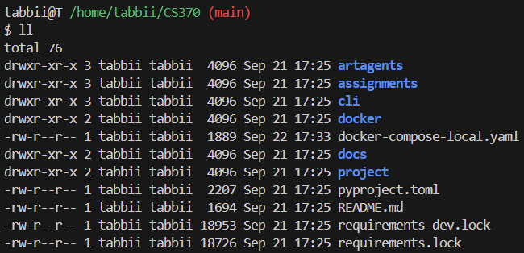

I couldn't set up the docker container since I don't have an NVIDIA gpu, and I couldn't figure out a workaround.
I was able to clone the repo, though, and everything aside from the container not being built seems to work.
