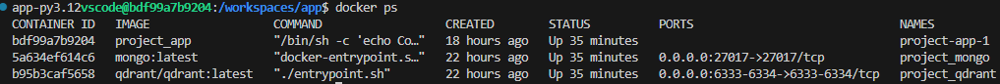
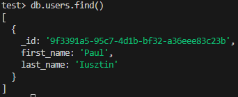
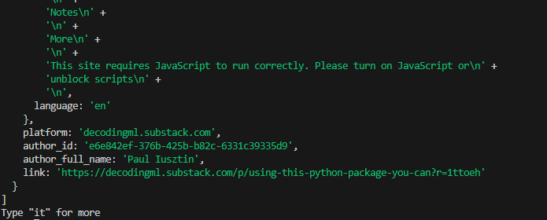

I was able to get the environment up and running. Figuring out how docker works was a pain. That dockerfile and docker-compose file were built from blood, sweat, and tears.

The working environment. There's no clearml container, since project_app just has to pip install it anyways.
I didn't see much purpose in making a separate container just to host a clearml server.

Could not for the life of me figure out how to replace zenml with the clearml api. It looks like both of them handle artifacts differently, and I got stuck.
The clearml pipeline api just didn't seem to work. Errors everywhere.

I could run a script independently and it made an entry in the database, so everything that went wrong has to do with me implementing clearml (or I guess *not* implementing it)

Since I got stuck there, couldn't really do anything else.
